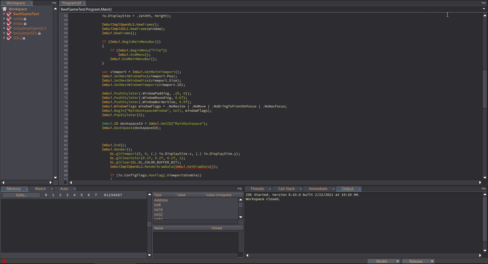

# Gruv-Beef-Theme
The gruvbox color scheme for the beeflang ide
  

To Install the Theme just paste it into the beef install location BeefLang/bin/themes  
if it doesnt already exist create a new folder named like it

You then have to set the theme in the ide:  
File -> preferences -> settings -> ui -> theme  
and then type the name of the folder into the input  
Gruv-Beef-Theme